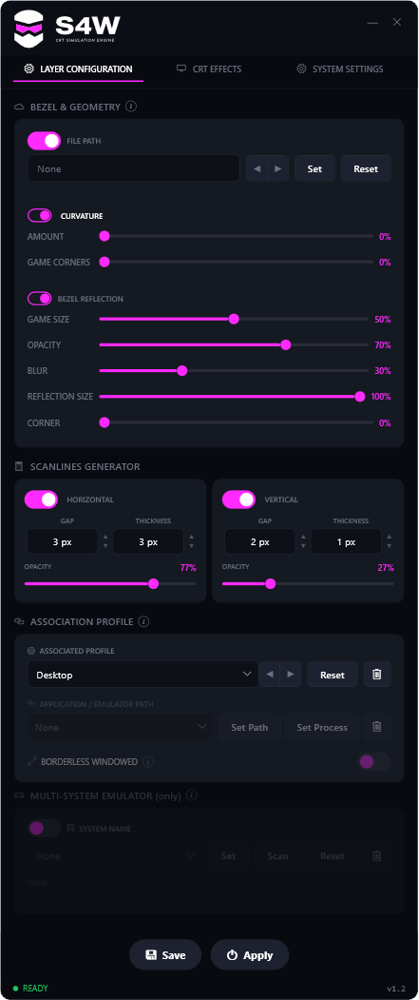

# S4W — Scanlines for Windows

A real-time **CRT / scanline effect injector** for PC games. S4W injects a hook DLL into
a running game, captures its rendered frame, and re-renders it through HLSL/GLSL shaders to
add scanlines, curvature, bloom, phosphor, VHS, a MegaBezel-style mirror reflection, and
more — all tunable live from a WPF control panel, without restarting the game.



## Features

- **Scanlines** — horizontal & vertical, with gap / thickness / opacity / region controls
- **CRT effects** — curvature, bloom, phosphor glow, flicker, blur, vignette / edge fade
- **Image grade** — brightness, contrast, saturation, temperature, black level, gamma
- **VHS pack** — tape noise, film grain, NTSC dot-crawl
- **MegaBezel reflection** — mirrors the game edges into the bezel area (size / opacity /
  blur / reflection size / corner), composited under a bezel PNG frame
- **Per-profile settings**, hotkeys, and multi-monitor support
- Works across **D3D11, D3D9, D3D12 (via D3D11On12), OpenGL and GDI** games

## How it works

- **`S4W.exe`** (C# / WPF) — the control panel. Writes settings to a named shared-memory
  block and injects the hook DLL.
- **`S4W_Hook.dll` / `_x86.dll`** (C++ / `Hook/S4W_Hook.cpp`) — injected into the game.
  Hooks the present/swap call of each graphics API, reads the shared settings, and draws
  the shader pipeline on the back buffer.

## Repository layout

```
App.xaml(.cs)            WPF app entry
MainWindow.xaml(.cs)     control-panel UI
OverlayWindow.xaml(.cs)  in-game overlay window
Models/                  settings, presets, profile/backup data models
Services/                injection, shared memory, hotkeys, profiles, rendering…
Helpers/                 input parsing, P/Invoke
Hook/S4W_Hook.cpp        the injected hook + HLSL/GLSL shaders (single file)
Hook/S4W_Injector_x86.cpp  32-bit injector helper
Hook/do_compile.bat      builds both hook DLLs (x64 + x86)
do_release.bat           builds + packages the C# app
tools/create_icon.ps1    icon generation helper
S4W.csproj               .NET 8 (net8.0-windows) WPF project
```

## Building

**C# app** (requires the .NET 8 SDK):

```sh
dotnet build S4W.csproj -c Release
# single-file self-contained release:
dotnet publish S4W.csproj -c Release -r win-x64 --self-contained true ^
  -p:PublishSingleFile=true -p:S4W_RELEASE=1
```

**Hook DLLs** (requires MSVC + Windows SDK):

```sh
Hook\do_compile.bat        # produces S4W_Hook.dll (x64) and S4W_Hook_x86.dll
```

> ⚠️ The `.bat` build scripts (`Hook/do_compile.bat`, `do_release.bat`, `Hook/run_compile.ps1`)
> contain **hardcoded absolute paths** for the original dev machine (MSVC location, project
> dir). Adjust them to your own toolchain/paths before building.

> ℹ️ The HLSL/GLSL shaders inside `S4W_Hook.cpp` are compiled **at runtime** by the game's
> graphics driver — a clean C++ compile does not validate the shader code. Watch the hook
> log for shader-compile errors on first run.

## Notes

- **Bezel art is not included** in this repo (size + third-party artwork). The build
  recreates an empty `Bezels/` folder; place your own bezel PNGs there.
- **License:** [MIT](LICENSE) © Kuato.
